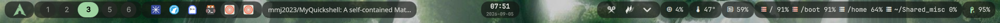

# MyQuickshell

A self-contained Quickshell desktop shell for Wayland compositors. It renders a
top bar (clock, workspaces, system tray) with a Material 3 theme, built on top
of [Quickshell](https://quickshell.outfoxxed.me) (requires >= 0.3.1, Qt 6).

This is a starting point: a single top bar, structured so that more modules
(control center, dock, notifications, lock, ...) can be added following the
same conventions.

> Requires a compositor with the wlr-layer-shell protocol (Hyprland, river,
> sway, and friends all support it). Workspace state is read via `hyprctl`; the
> bar degrades gracefully on other compositors, simply hiding that widget.

## Showcase



## Structure

- `shell.qml` - entry point
- `Common/` - app-wide singletons (`Theme`)
- `Services/` - headless singletons that talk to the system
- `Modules/Bar/` - the visible top bar
- `Modules/Bar/Widgets/` - reusable widgets (Clock, Workspaces, SystemTray)

## Running

```sh
make run        # foreground
make run-detach # background (daemonized)
```

or directly:

```sh
quickshell -p .            # foreground
quickshell -p . -d         # daemonized
```

## QML modules

| Import          | File              |
|-----------------|-------------------|
| `qs.Common`     | `Common/qmldir`   |
| `qs.Services`   | `Services/qmldir` |
| `qs.Modules.Bar`| `Modules/Bar/qmldir` |
| `qs.Modules.Bar.Widgets` | `Modules/Bar/Widgets/qmldir` |

## Theming

All colors, spacing, and typography come from `Common/Theme.qml` (Material 3
tokens: `surfaceContainer`, `onSurface`, `primary`, ...). Widgets reference
theme tokens instead of hardcoding values.

## Adding a backend (IPC seam)

`Services/DMSService.qml` is a no-op seam for a future backend (Go/Python/Rust/
C/C++). It reads a socket path from `$MYSHELL_SOCKET` and exposes
`backendAvailable`, `sendRequest()`, and `subscribe()`. Hook your backend
process here without touching the UI.

<details>
<summary>AI assistance</summary>

This project has been developed with assistance from GitHub Copilot, OpenCode,
and Antigravity. AI-generated changes are reviewed and validated by the project
maintainer.

</details>
